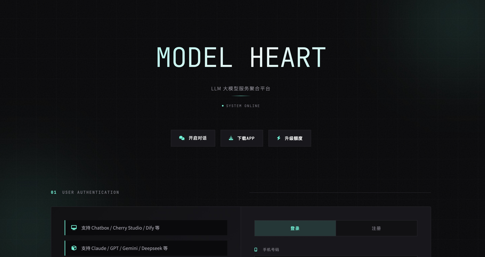

# Model Heart - LLM API Gateway



An enterprise-grade LLM API gateway system supporting multi-model aggregation, intelligent routing, and unified authentication.

🌐 **Live Demo**: [https://api.aihao.world](https://api.aihao.world)

[🇨🇳 中文文档](README_CN.md)

---

## ✨ Core Features

- 🔄 **Intelligent Load Balancing** - Weighted round-robin, health checks, automatic failover
- 🔐 **Unified Authentication** - API Key management, Session control, permission management
- 📊 **Usage Monitoring** - Token-level statistics, real-time quotas, multi-dimensional analysis
- 🌐 **Multi-Protocol Support** - OpenAI / Anthropic compatible interfaces
- 🚀 **High Performance** - HTTP/2 support, streaming response, connection pool optimization

## 🚀 Quick Start

### Option 1: Docker Deployment (Recommended)

The easiest way to deploy using Docker Compose:

```bash
# 1. Clone the repository
git clone https://github.com/firslov/modelheart.git
cd modelheart

# 2. Configure environment
cp .env.example .env
# Edit .env file with your settings

# 3. Start with Docker Compose
docker-compose up -d

# 4. View logs
docker-compose logs -f
```

**Default Access**: http://localhost:8087

**Default Admin Credentials**:
- Username: `admin`
- Password: `admin` (if ADMIN_PASSWORD_HASH not set)

> ⚠️ **Important**: Change the default password after first login!

#### Docker Compose Commands

```bash
# Start services
docker-compose up -d

# Stop services
docker-compose down

# Restart
docker-compose restart

# View logs
docker-compose logs -f

# Update to latest version
docker-compose pull && docker-compose up -d

# With Nginx reverse proxy
docker-compose --profile with-nginx up -d
```

### Option 2: Manual Deployment

#### 1. Install Dependencies

```bash
pip install -r requirements.txt
```

#### 2. Configure Environment

```bash
# Copy configuration template
cp .env.example .env

# Edit configuration file
vim .env
```

**Required Configuration**:

```bash
# Domain configuration
DOMAIN=your-domain.com
API_BASE_URL=https://api.your-domain.com

# Session secret key (must be changed to a random string)
SESSION_SECRET_KEY=your-random-secret-key

# Admin password (generate hash)
# Generate with: python -c "import bcrypt; print(bcrypt.hashpw(b'your_password', bcrypt.gensalt()).decode())"
ADMIN_PASSWORD_HASH=$2b$12$...
```

#### 3. Initialize Database

```bash
python scripts/init_database.py
```

#### 4. Start Service

```bash
# Production
./start.sh

# Development (auto-reload)
DEV=1 ./start.sh

# Custom parameters
WORKERS=8 PORT=9000 LOG_LEVEL=debug ./start.sh
```

Visit: http://localhost:8087

## 📖 API Usage

### 📊 Billing

Usage is charged based on tokens consumed. The billing method varies by endpoint:

| Endpoint | Billing Method | Details |
|----------|----------------|---------|
| `/v1/chat/completions` | Token-based | Input tokens × Input weight + Output tokens × Output weight |
| `/v1/completions` | Token-based | Input tokens × Input weight + Output tokens × Output weight |
| `/v1/embeddings` | Token-based | Input tokens × Model weight |
| `/anthropic/v1/messages` | Request-based | Max(Input weight, Output weight) × Request count |
| `/coding/chat/completions` | Request-based | Max(Input weight, Output weight) × Request count |

### OpenAI Compatible Interface

#### Chat Completions - `/v1/chat/completions`
- **Billing**: Token-based (input + output tokens)
- **Use Case**: General chat applications

```bash
curl https://api.your-domain.com/v1/chat/completions \
  -H "Authorization: Bearer your-api-key" \
  -H "Content-Type: application/json" \
  -d '{
    "model": "gpt-3.5-turbo",
    "messages": [{"role": "user", "content": "Hello"}]
  }'
```

#### Embeddings - `/v1/embeddings`
- **Billing**: Token-based (input tokens only)
- **Use Case**: Text embedding and similarity search

```bash
curl https://api.your-domain.com/v1/embeddings \
  -H "Authorization: Bearer your-api-key" \
  -H "Content-Type: application/json" \
  -d '{
    "model": "text-embedding-ada-002",
    "input": "Hello world"
  }'
```

#### Coding Interface - `/coding/chat/completions`
- **Billing**: Request-based (max of input/output weights)
- **Use Case**: Code generation, Zhipu AI Coding Plan, etc.
- **Note**: OpenAI-compatible format but charged per request

```bash
curl https://api.your-domain.com/coding/chat/completions \
  -H "Authorization: Bearer your-api-key" \
  -H "Content-Type: application/json" \
  -d '{
    "model": "zhipu-coding-model",
    "messages": [{"role": "user", "content": "Write a Python function"}]
  }'
```

### Anthropic Compatible Interface

#### Messages - `/anthropic/v1/messages`
- **Billing**: Request-based (max of input/output weights)
- **Use Case**: Claude models and request-based billing models

```bash
curl https://api.your-domain.com/anthropic/v1/messages \
  -H "x-api-key: your-api-key" \
  -H "anthropic-version: 2023-06-01" \
  -H "Content-Type: application/json" \
  -d '{
    "model": "claude-3-5-sonnet-20241022",
    "max_tokens": 1024,
    "messages": [{"role": "user", "content": "Hello"}]
  }'
```

## 🔧 Environment Variables

| Variable | Description | Default |
|----------|-------------|---------|
| `ENV` | Runtime environment | `development` |
| `DOMAIN` | Domain name | `localhost` |
| `API_BASE_URL` | API base URL | `http://localhost:8087` |
| `SESSION_SECRET_KEY` | Session secret key | - |
| `ADMIN_USERNAME` | Admin username | `admin` |
| `ADMIN_PASSWORD_HASH` | Admin password hash | - |
| `DEFAULT_LIMIT` | Default API limit | `1000000` |

## 🐳 Docker Deployment Guide

### Production Deployment

1. **Prepare Environment**
   ```bash
   cp .env.example .env
   # Edit .env with production settings
   ```

2. **Generate Secure Password**
   ```bash
   # Generate bcrypt hash for admin password
   docker run --rm python:3.11-slim python -c "
   import bcrypt
   password = 'your-secure-password'
   hashed = bcrypt.hashpw(password.encode(), bcrypt.gensalt())
   print(hashed.decode())
   "
   ```

3. **Configure .env**
   ```bash
   DOMAIN=your-domain.com
   API_BASE_URL=https://api.your-domain.com
   SESSION_SECRET_KEY=$(openssl rand -hex 32)
   ADMIN_PASSWORD_HASH=<generated-hash>
   ```

4. **Deploy**
   ```bash
   docker-compose up -d
   ```

### With Nginx Reverse Proxy

```bash
# Create ssl directory
mkdir -p ssl

# Place your SSL certificates
# ssl/cert.pem
# ssl/key.pem

# Start with Nginx
docker-compose --profile with-nginx up -d
```

### Docker Build (Custom)

```bash
# Build image
docker build -t model-heart:latest .

# Run container
docker run -d \
  --name model-heart \
  -p 8087:8087 \
  -v $(pwd)/data:/app/data \
  -v $(pwd)/logs:/app/logs \
  -v $(pwd)/.env:/app/.env:ro \
  --restart unless-stopped \
  model-heart:latest
```

## 🏗️ Project Structure

```
myapi/
├── app/                    # API routes
│   ├── api/                # API routes
│   ├── config/             # Configuration management
│   ├── core/               # Application core
│   ├── database/           # Data layer
│   ├── middleware/         # Middleware
│   ├── models/             # Data models
│   ├── services/           # Business logic
│   └── utils/              # Utility functions
├── static/                 # Static assets
├── templates/              # HTML templates
├── scripts/                # Scripts
├── .env.example            # Configuration template
├── requirements.txt        # Dependencies
├── start.sh                # Startup script
├── Dockerfile              # Docker image definition
├── docker-compose.yml      # Docker Compose configuration
├── docker-entrypoint.sh    # Docker entrypoint script
└── nginx.conf              # Nginx configuration
```

## 📄 License

MIT License

## 🤝 Contributing

Issues and Pull Requests are welcome!

---

**Made with ❤️ by [firslov](https://github.com/firslov)**
